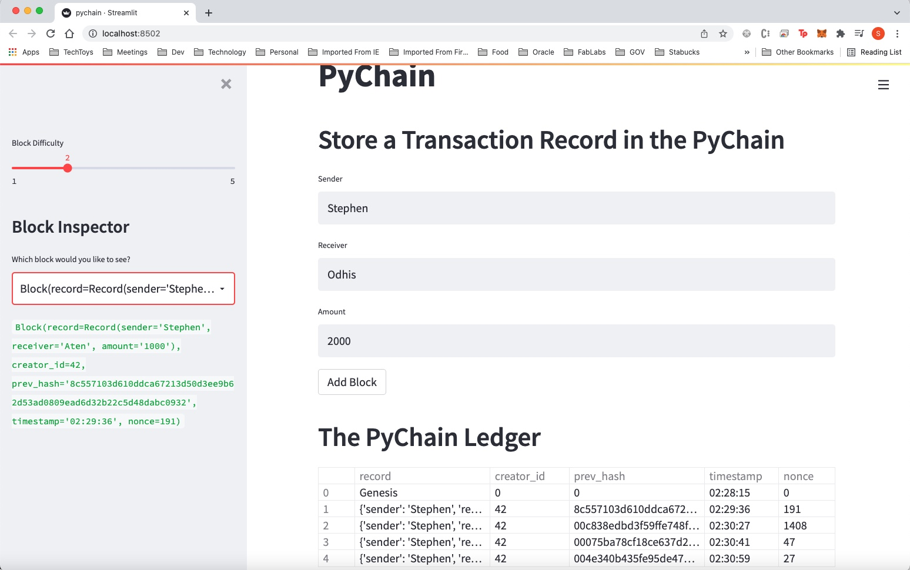
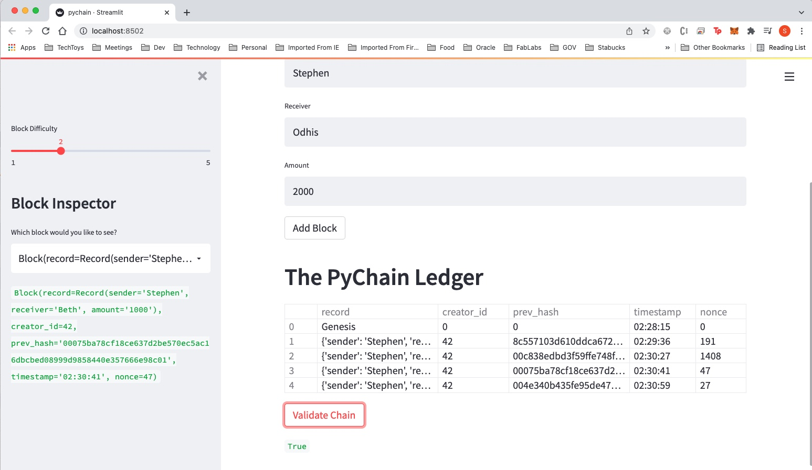

# blockchain_ledger
This repository is for a blockchain ledger systems

# blockchain ledger application: new application 

This is a fintech tool that helps partner financial instituitions safely conduct financial transactions transparently with the ability to verify the integrity of the data in the ledgerat any given time.


---

## Technologies


*[python](https://docs.python.org/3/) - For documentation
*[streamlit](https://docs.streamlit.io/) - Documentation


---

## Installation Guide

Before running the application first install the following dependencies.

```python
  pip install streamlit  

    
```

---

## Usage
Please navigate to the folder where the file is loacated

[pychain.py](https://colab.research.google.com/github/tylergusmyers/ML_token_prices/blob/main/BTC_Pricing_Model.ipynb) 


with the:

```
from command line type:

streamlit run pychain.py
```

---

## Test Results of the Rocords stored in PyChain Ledger

**1) Storage of multiple blocks**

   



**2) Validation**

   



## Contributors

Brought to you by: odhissm@gmail.com
  

---

## License

MIT

